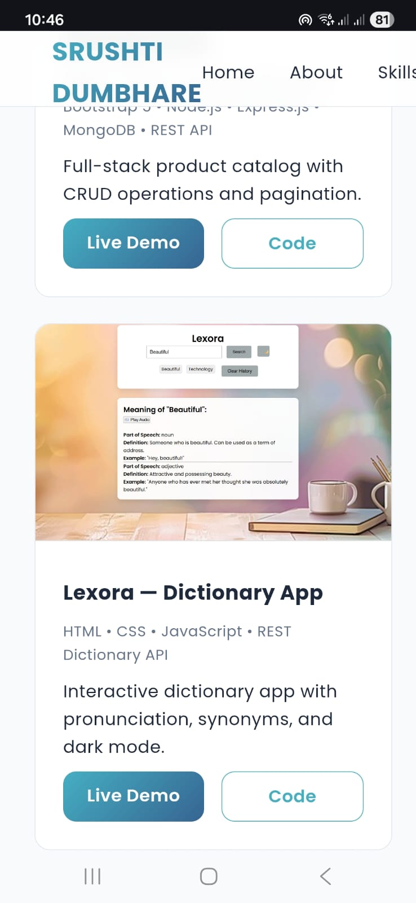

# 🌐 Portfolio — Srushti Dumbhare

Java Full Stack Developer | Web Developer | Problem Solver

This is my personal portfolio website built using **pure HTML and CSS**.  
It showcases my education, skills, projects, internships, and certificates in a clean and responsive layout.

---

## 🚀 Live Website
👉 https://srushtidumbhare7-ad.github.io/portfolio/

---

## 🛠 Technologies Used
- **HTML5** – Structure and content
- **CSS3** – Styling, layout, animations, responsiveness
- **Google Fonts** – Typography
- **Remix Icons** – Icons
- **GitHub Pages** – Hosting

> ❗ No JavaScript or frameworks are used in this project.

---

## ✨ Website Features
- Clean and modern UI
- Fully responsive design (desktop & mobile)
- Sticky navigation bar
- About section with profile image
- Skills displayed using cards and badges
- Timeline-based education and experience
- Certificates linked as PDF/image files
- Resume download option
- Project showcase with live demos & source code links

---

## 📂 Folder Structure
portfolio/
├── index.html
├── style.css
├── README.md
│
├── images/
│ ├── photo.jpg
│ ├── spendsense.png
│ ├── productCatalog.png
│ ├── lexora.png
│ └── CurrenX.png
│
├── certificates/
│ ├── Srushti_Dumbhare_resume.pdf
│ ├── aicte.pdf
│ ├── teachnook.jpg
│ ├── tata.pdf
│ └── deloitte.pdf
│
├── screenshots/
│ ├── home-navbar.png
│ ├── projects-section.png
│ └── responsive-view.png

---

## 📸 Screenshots

### Home Section with Navigation Bar
Shows the hero section along with the fixed navigation bar and social icons.

---

### Projects Section
Displays the project cards with images, technology stack, and live/code links.

---

### Responsive View
Demonstrates the responsive layout on smaller screen sizes (mobile view).

---

## 📌 Sections Included
- **Home**
- **About Me**
- **Education**
- **Experience & Certificates**
- **Skills**
- **Projects**
- **Contact**
- **Footer**

---

## 📁 Projects Showcased
- **SpendSense** — Expense Tracker  
- **Product Catalog Management System**  
- **Lexora** — Dictionary App  
- **CurrenX** — Currency Converter  

Each project includes:
- Live demo link
- GitHub repository link

---

## 🎓 Education & Experience
- B.E. Computer Engineering — SPPU  
- Java Full Stack Internship — AICTE  
- Web Development Internship — Teachnook  
- Data Analytics Virtual Internship — TATA & Deloitte (Forage)

---

## 📄 License
This project is open-source and created for learning, practice,and portfolio purposes.
