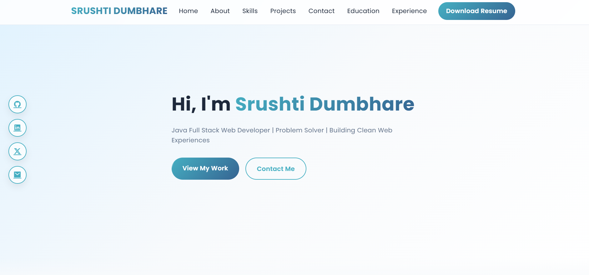
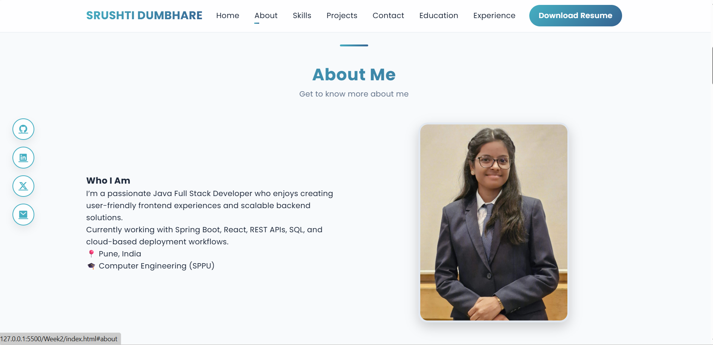
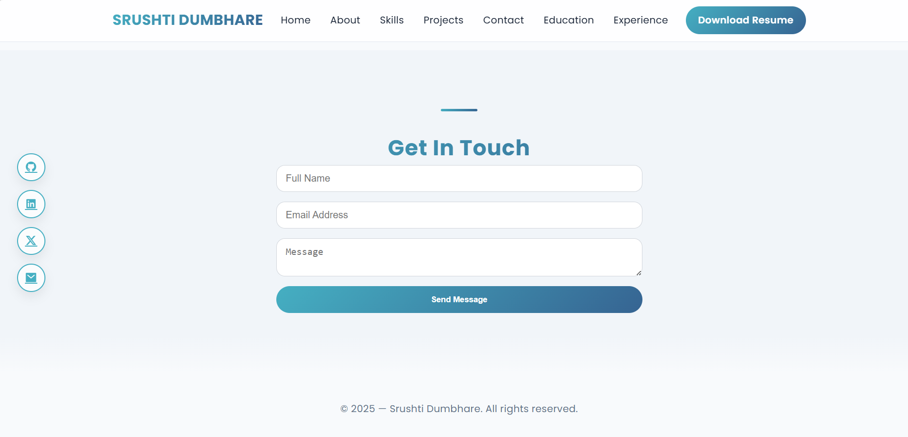

# 🌐 Srushti Dumbhare — Portfolio Website

A modern, responsive personal portfolio website showcasing my skills, projects, education, and professional experience as a **Java Full Stack Developer**.

🔗 **Live Demo:**  
https://srushtidumbhare7-ad.github.io/portfolio/

---

## 📸 Screenshots

### 🏠 Home Section

### 👩‍💻 About & Skills

### 🧩 Projects

### Contact

---

## ✨ Features

- Clean & modern UI with smooth animations  
- Fully responsive (mobile, tablet & desktop)  
- Fixed glassmorphism navbar  
- Timeline-based Education & Experience  
- Project cards with Live Demo & GitHub links  
- Downloadable resume  
- Social media integration  
- Contact form UI  

---

## 🛠️ Tech Stack

### Frontend
- HTML5  
- CSS3  
- JavaScript (Vanilla)

### UI & Styling
- CSS Variables  
- Flexbox & Grid  
- Animations & transitions  
- Google Fonts (Poppins, JetBrains Mono)  
- Remix Icons  

---

## 📂 Folder Structure

portfolio/
│
├── certificates/
├── images/
├── screenshots/
│
├── README.md
├── index.html
├── style.css
└── README.md
